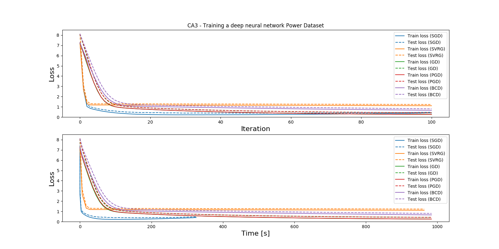
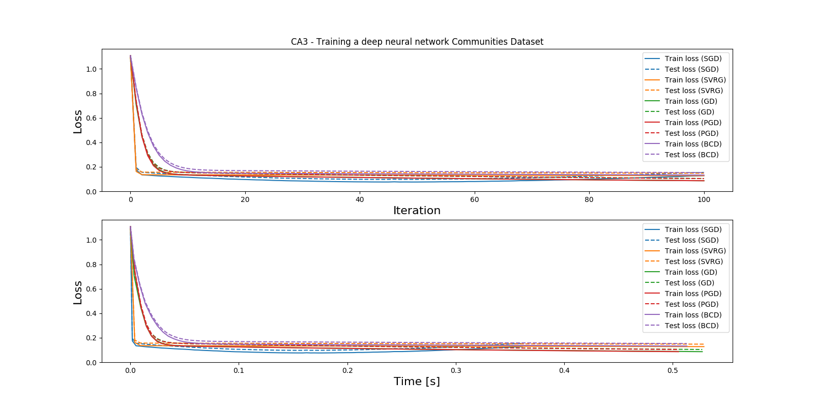

# Computer Assignments in EP3260: Fundamentals of Machine Learning Over Networks

## TL;DR;

1. Install dependencies by running `pip install -r requirements.txt`.
2. Run `make` to download all the data and run the code, or just `make dataset` to download the data.

## Assignment 3 - Training a deep neural network

Defined in [Lecture 4](https://drive.google.com/file/d/1XNSLc1MsWGAWIIDW0l6ygdVdpep2yHuK/view)

 

Consider optimization problem $`minimize_{\mathbf{W}_1,\mathbf{W}_2,w_3} \frac{1}{N} \sum_{i \in [N]} ||w_3 s(\mathbf{W}_2 s(\mathbf{W}_1 x_i))||^2_2`$ , where $`s(x) = \frac{1}{1 + exp(-x)}`$. Consider both “Communities and crime” and “Individual household electric power consumption” regression datasets.

1. Solve the optimization problem using GD, perturbed GD, stochastic GD, SVRG, and block coordinate descent.

2. Compare these solvers in terms complexity of hyper-parameter tunning, convergence time, convergence rate (in terms of # outer-loop iterations), and memory requirement

See figure above for convergence time (including calculating cost for training and test sets.)

| Solver | Convergence time | Convergence rate |               Memory req.                |      |
|--------|------------------|------------------|------------------------------------------|------|
| SGD    | See fig.         | See fig.         | 1                                        |      |
| SVRG   | See fig.         | See fig.         | One memory, two gradients per inner loop |      |
| PGD    | See fig.         | See fig.         | N                                        |      |
| BCD    | See fig.         | See fig.         | N                                        |      |
| GD     | See fig.         | See fig.         | N                                        |      |

## Datasets

|                     Dataset                     | # Instances | # Attributes |
|-------------------------------------------------|-------------|--------------|
| Communities and Crime Data Set                  |        1994 |          128 |
| Individual household electric power consumption |     2075259 |            9 |

### Communities and Crime Data

[Communities and Crime Data Set ](http://archive.ics.uci.edu/ml/datasets/communities+and+crime)
 
Communities within the United States. The data combines socio-economic data from the 1990 US Census, law enforcement data from the 1990 US LEMAS survey, and crime data from the 1995 FBI UCR.

### Individual household electric power consumption
 
[Individual household electric power consumption Data Set ](https://archive.ics.uci.edu/ml/datasets/individual+household+electric+power+consumption)

Measurements of electric power consumption in one household with a one-minute sampling rate over a period of almost 4 years. Different electrical quantities and some sub-metering values are available.
    

## Links

- https://github.com/vbordalo/Communities-Crime/blob/master/Crime_v1.ipynb
- https://cvxopt.org/index.html
- https://github.com/cvxgrp/cvxpy/blob/master/examples/machine_learning/ridge_regression.ipynb
- https://www.quora.com/What-is-ridge-regression-How-do-you-find-its-closed-form-solution
